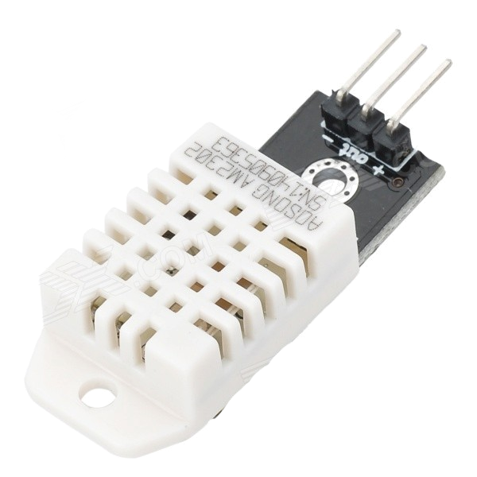
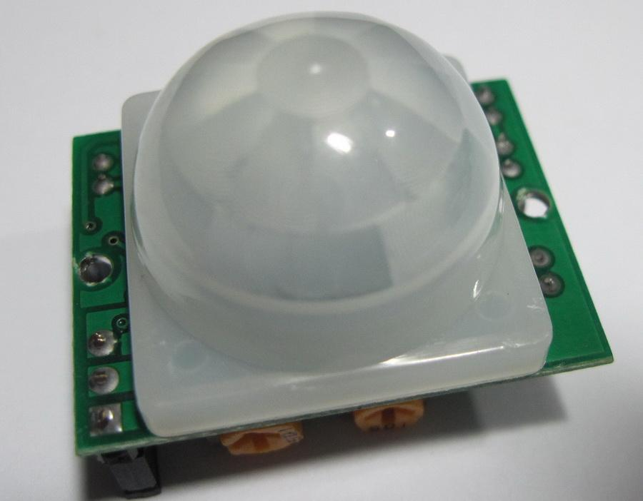

# IoT Yourself: Hack your home!


Este repositorio contiene la presentación realizada en [NoConName](http://www.noconname.org) en Diciembre 2015 y el código fuente usado para ello.

Estas notas nos ayudan a la instalación de las librerías necesarias y su configuración para que el código fuente proporcionado funcione.

Se ha usado una Raspberry Pi con sensores como la base de ejecución de este proyecto.

## Configuración básica Raspberry Pi


Instalación y configuración de Raspberry Pi:
<pre>
sudo apt-get install rpi-update
sudo rpi-update
raspi-config
</pre>

## SENSOR DE TEMPERATURA DHT22



* Actualización del sistema:
```bash
sudo apt-get update
sudo apt-get upgrade
sudo apt-get install build-essential python-dev
```

* Instalación de la librería de Adafruit:
<a href="" target="_blank">https://github.com/adafruit/Adafruit_Python_DHT</a>
```bash
cd /home/pi
git clone https://github.com/adafruit/Adafruit_Python_DHT.git
cd Adafruit_Python_DHT
sudo python setup.py install
```

* Instalación de la librería de RRDTool:
```bash
sudo apt-get install rrdtool librrds-perl
```

* Instalación de Apache:
```bash
sudo usermod -a -G www-data www-data
sudo apt-get install apache2
```

* Configuración de Apache:
```bash
sudo vim /etc/apache2/apache2.conf
```
> Escribir la línea:
> `ServerName localhost`

* Reinicio de Apache:
```bash
sudo service apache2 restart
sudo service apache2 reload
```
* Instalación y verificación:
```bash
sudo mkdir /var/www/rrdtool/
sudo mv /home/pi/rrd_temphum.pl /usr/local/bin/rrd_temphum.pl
sudo chmod +x /usr/local/bin/rrd_temphum.pl
file -bi /usr/local/bin/rrd_temphum.pl
```
> `text/x-perl; charset=utf-8`
>
> sino corregir con:
>
```bash
sudo su -
iconv -f iso-8859-1 -t utf8 /usr/local/bin/rrd_temphum.pl > /usr/local/bin/rrd_temphum0.pl
rm /usr/local/bin/rrd_temphum.pl
mv /usr/local/bin/rrd_temphum0.pl /usr/local/bin/rrd_temphum.pl
export LANG=es_ES.utf8
echo $LANG
dpkg-reconfigure locales
```
* Borrar BBDD: `sudo rm /opt/Humidity.rrd /opt/Temperature.rrd`
* Configurar cron para ejecución cada 1 minuto: `sudo crontab -e`
> `*/1 * * * * /usr/local/bin/rrd_temphum.pl 2>&1 >> /dev/null`

* Colocar archivos web en el sitio:
```bash
sudo mv /home/pi/temperature.html /var/www/temperature.html
sudo mv /home/pi/humidity.html /var/www/humidity.html
sudo mv /home/pi/index.html /var/www/index.html
```

## WEBCAM + PIR



* Instalación de paquetes necesarios:
```bash
sudo apt-get install fswebcam mencoder ffmpeg
```

* Test de webcam:
```bash
fswebcam -i 0 -d /dev/video0 -r 640x480 -q --title test --no-banner /home/pi/captura_%d%m%y_%H%M%S.jpg
```

* Creación de vídeo a partir de las imagenes capturadas:
```bash
ls *.jpg > lista.txt
mencoder -nosound -ovc lavc -lavcopts vcodec=mpeg4:aspect=16/9:vbitrate=8000000 -vf scale=640:480 -o timelapse.avi -mf type=jpeg:fps=24 mf://@lista.txt
```

## SONIDO y AUDIO

* Instalación de paquetes necesarios:
```bash
sudo apt-get update
sudo apt-get install alsa-utils mpg321
```

* Pruebas de sonido:
```bash
sudo modprobe snd_bcm2835
sudo amixer cset numid=3 1
mpg321 -g 50 -q intruso_detectado.mp3
```

## IFTTT + BLINK


Para esta práctica no hace falta instalar ningún paquete adicional únicmanete tener en cuenta la siguiente información.

Enlaces de blink:
<pre>
http://api.thingm.com/blink1/events/0011xxxxxxxxxx23
http://api.thingm.com/blink1/eventsall/0011xxxxxxxxxx23
</pre>

<pre>
{
  "events":[
    {
      "blink1_id":"0011xxxxxxxxxx23",
      "date":"1449613841",
      "name":"ASUSTAR",
      "source":"DO Button"
    }
  ],
  "event_count":1,
  "status":"events saved"
}
</pre>

**Nota:** este código `0011xxxxxxxxxx23` debe ser reemplazado por uno vuestro (supuestamente de vuestro blink)

URL and IFTTT inputs was fetched every 30 seconds:
* INFO: https://github.com/todbot/blink1/blob/master/docs/app-url-api.md
* Ver API: http://api.thingm.com/blink1/web-api.txt

## MOSQUITTO MQTT broker (server) + CLIENT


* Instalación del repositorio y las claves de Mosquito
```bash
curl -O http://repo.mosquitto.org/debian/mosquitto-repo.gpg.key
sudo apt-key add mosquitto-repo.gpg.key
rm mosquitto-repo.gpg.key
cd /etc/apt/sources.list.d/
sudo curl -O http://repo.mosquitto.org/debian/mosquitto-wheezy.list
sudo apt-get update
```

* Instalación de la aplicación:
```bash
sudo apt-get install mosquitto mosquitto-clients 
```

* Copiar configuración básica de ejemplo:
```bash
sudo cp /usr/share/doc/mosquitto/examples/mosquitto.conf /etc/mosquitto/conf.d/mosquitto.conf
sudo vim /etc/mosquitto/conf.d/mosquitto.conf
```

* Recargar configuración y ver status:
```bash
sudo /etc/init.d/mosquitto reload
sudo /etc/init.d/mosquitto status
```

* Pruebas:
```bash
mosquitto_sub -t /mqttitude
mosquitto_pub -h localhost -t "mensaje" -m "LUZ ACTIVADA"
mosquitto_sub -d -h localhost -t "temperature"
```

* Instalaciones de Python para mosquito (Paho-MQTT):
```bash
sudo apt-get install python-pip
sudo pip install paho-mqtt
```

## WhatsApp en Python con Yowsup


* Instalaciones paquetes necesarios:
```bash
sudo apt-get install python-dateutil
sudo apt-get install python-setuptools
sudo apt-get install python-dev
sudo apt-get install libevent-dev
sudo apt-get install ncurses-dev
sudo apt-get build-dep python-imaging
sudo apt-get install libjpeg8 libjpeg62-dev libfreetype6 libfreetype6-dev
```

* Clonar el repositorio e instalar:
```bash
cd
git clone git://github.com/tgalal/yowsup.git
cd yowsup
sudo python setup.py install
```

* Información sobre MCC y MNC de España:
<pre>
MCC MNC 
214 07
</pre>
[From more info here.](https://es.wikipedia.org/wiki/MCC/MNC)

* Solicitar SMS para registrar teléfono:
```bash
sudo python yowsup-cli registration --requestcode sms --phone 34xxxxxxxxx --cc 34 --mcc 214 --mnc 07
```

* Indicar número recibidio en el SMS:
```bash
python yowsup-cli registration --register xxx-xxx --phone 34xxxxxxxxx --cc 34
```

* Establecer en el archivo `config` los datos recibidos:
```bash
sudo vim /home/pi/yowsup/config
```
<pre>
	## Actual config starts below ##

	cc=34 #if not specified it will be autodetected

	phone=34xxxxxxxxx

	password=yyyyyyyyyyyy
</pre>

* Enviar mensaje para probar si funciona:
```bash
sudo yowsup-cli demos --yowsup --config /home/pi/yowsup/config
```

You will be greeted with the Yowsup prompt. To login you may enter `/L` and enter your login credentials you saved in the config file. You can see a list of commands by typing `/help`. Use the /message command to send a message to your desired number.

<pre>
/message send 91xxxxxxxxxx "Your message"
</pre>

* Probar el código:
<pre>
/whatsapp $ sudo python run.py
</pre>

> BASADO en: git clone git://github.com/rpi-jefer/Raspberry-Pi-WhatsApp.git
